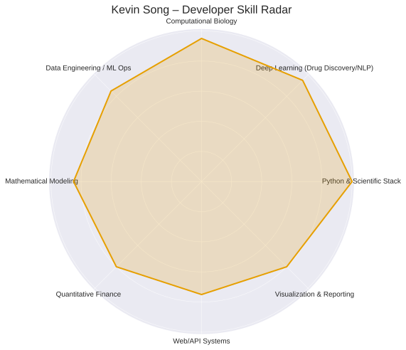

# Kevin Song
**PhD Researcher | AI Developer | Computational Biomedical Engineer**

🔬 I build **AI systems that model intelligence in biology and data**, merging deep learning, network science, and quantitative reasoning.  
⚙️ My focus is on creating **interpretable and scalable architectures** that bridge biological computation, systems design, and algorithmic strategy.  
🧩 Every model I design functions as a living system — modular, transparent, and self-consistent across abstraction layers.

---

## 🧭 Core Technical Competence

### 🧰 Technical Matrix

| Domain | Proficiency | Stack / Tools | Primary Focus |
|:--|:--:|:--|:--|
| **Python & Scientific Ecosystem** | 🟦 **10/10** | NumPy • Pandas • SciPy • Matplotlib • PyTorch | Research pipelines, tensor computation, optimization |
| **Deep Learning (Biomedical / NLP)** | 🟦 **9.5/10** | ESM2 • RDKit • HuggingFace • BioBERT | Sequence modeling, affinity prediction, embeddings |
| **Computational Biology & Network Modeling** | 🟦 **9.5/10** | STRING • COPASI • PySB • scRNA-seq | Systems analysis, multi-omic integration |
| **Data Engineering & ML Ops** | 🟨 **8.5/10** | Docker • TensorBoard • GitHub Actions | Workflow automation, reproducibility, experiment tracking |
| **Quantitative Finance & Strategy Algorithms** | 🟧 **8/10** | Alpaca API • TA-Lib • PandasTA | Trading logic, time-series filtering, risk metrics |
| **Web/API Systems & Agent Integration** | 🟩 **7.5/10** | FastAPI • Flask • REST APIs | Agentic pipelines, data-driven microservices |
| **Visualization & Scientific Reporting** | 🟩 **8/10** | Matplotlib • Plotly • LaTeX | Data visualization, figure generation, interpretability |

---

## 🧬 Engineering Philosophy

> “Architecture is intelligence made visible.”

- **Systemic Design:** Treat each codebase as a model of interaction—between data, algorithms, and hypotheses.  
- **Analytical Transparency:** Ensure traceable reasoning between biological mechanisms and model predictions.  
- **Minimalist Infrastructure:** Favor modular architectures and automated testing over manual complexity.  
- **Cross-Domain Abstraction:** Apply shared principles of optimization, feedback, and emergence to all problem spaces.  
- **Reproducible Science:** Integrate CI/CD, containerization, and documentation for durable research ecosystems.

---

## 🔭 Research & Application Focus

**Domains:**  
AI for Drug Discovery • Computational Biology • Quantitative Systems Design • Scientific Computing  

**Methodological Interests:**  
Neural embeddings • Graph networks • Topological and network-based inference • High-dimensional data integration  

**Long-Term Vision:**  
To build *adaptive computational architectures* that unify the intelligence principles found in both biology and artificial systems — enabling more explainable, ethical, and cross-disciplinary AI.
